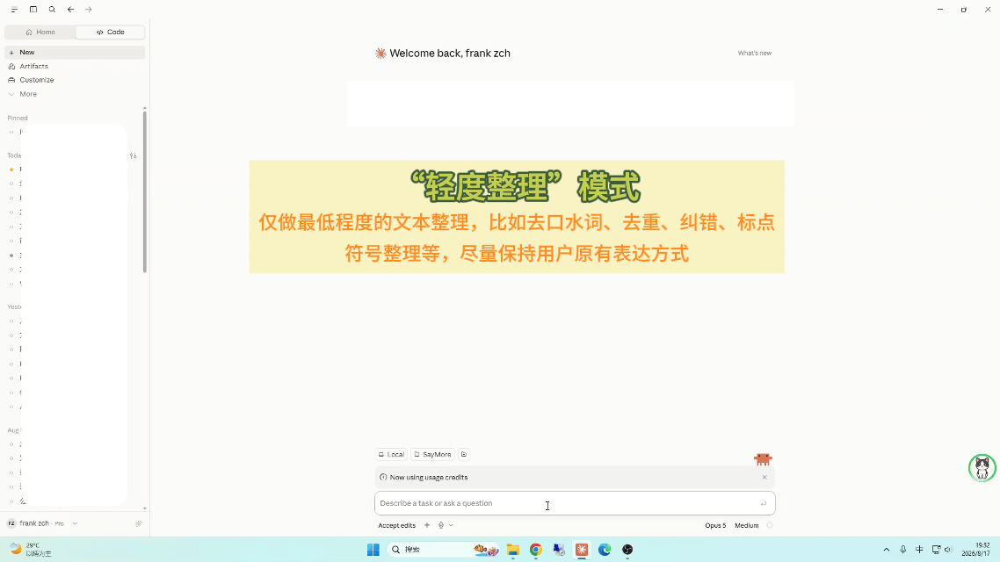
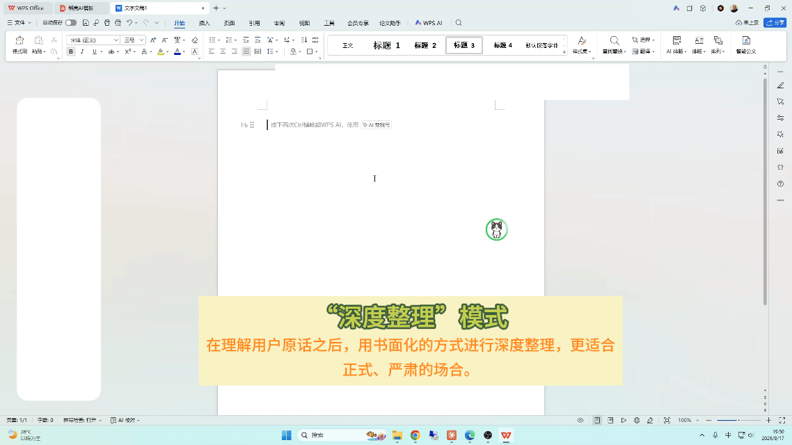
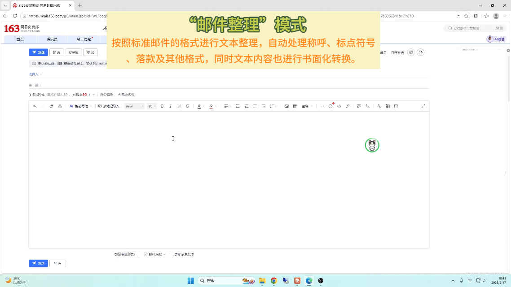

# Saymore · 多说话，少打字！

Saymore是一个纯本地的语音输入程序，具备**语音识别 + 文本整理 + 自定义术语 + 上下文语境识别 + 历史热词提炼**等功能。其中文本整理功能除了最基本的去口水词、重复词、纠错、标点符号修正等之外，还增加了4种整理方式，包括最能保留用户原始说话风格的轻度整理、将口语转换为书面化风格的深度整理、邮件格式整理、00后语言风格整理。目前程序只有windows客户端（mac和linux随后推出），安装后常驻后台，使用唤醒词启动（默认唤醒词‘小咪’，可在配置里修改）。使用普通cpu可流畅运行，使用4G显存的GPU可以提高一倍的速度。
下面是几个整理方式的示例：

**轻度整理**(保留原始说话风格,只去口水词/重复词/纠错/加标点):



**深度整理**(口语 → 书面语):



**邮件整理**(口语 → 邮件正文):




### 核心特点(一览)

- **全本地、零上传**:ASR、文本整理、热词学习都在本机跑，所有内容全在本地，0上传。
- **常驻 + 唤醒词**:后台驻留,说唤醒词后（默认`小咪`，可修改)才开始录,不用按键。超过5分钟无语音输入则主动休眠，卸载模型，节省系统资源。
- **多种文本整理方式**:已微调文本整理LoRA,支持多种整理方式(轻度/深度/邮件/00后),可以去掉口水词、重复词、自动纠错、转换为书面用语/邮件格式、转换说话风格（00后）。
- **CPU可流畅运行、GPU只需4G显卡**:CPU运行语音识别大概1-2秒，GPU只需0.5秒。整段文字的文本整理CPU稍慢，大概5秒左右，GPU在2秒左右。
- **自定义专业术语**:可以自定义几十个专业术语，会自动加入大模型上下文，让程序识别更精准。
- **从上下文提词、从历史记录提词**:从当前对话窗口的上下文里提取术语，并从用户本地历史记录提取高频专业词汇，放入模型的上下文，让模型越用越懂你。
- **语音命令**:通过一系列自定义的语音命令来控制程序，无须触碰键盘，比如直接说"发送"回车、"回退"删词、"清空"清屏、"休眠"下线。

---

## 跟市面上的东西比,它到底不一样在哪

挑三个对标品直接摆开:**Typeless**(海外爆款商业 AI 听写)、**微信输入法**(国内用户量最大的免费语音输入)、**OpenWispr**(海外热门的本地开源方案)。

| | **Saymore** | Typeless | 微信输入法(语音) | OpenWispr / OpenWhispr |
|---|---|---|---|---|
| **中文识别质量** | ✅ Qwen3-ASR,当前中文 SOTA 之一 | ⚠️ 强项在英文,中文一般 | ✅ 腾讯大模型,中文强 | ⚠️ Whisper 中文一般;Parakeet 无中文 |
| **本地 / 隐私** | ✅ **100% 本地** | ❌ 云端(音频上传 AWS) | ❌ 云端(离线仅基础版) | ✅ 本地(也支持云 BYOK) |
| **价格** | ✅ 免费开源 | ❌ **$30/月 或 $144/年**;免费版 8000 词/周封顶 | ✅ 免费 | ✅ 免费开源 |
| **口语 → 书面语润色** | ✅ 本地 LoRA,四种人格(轻度/深度/邮件/00后) | ✅ 云端 LLM,按 app 自适应语气 | ⚠️ 去"嗯/呃"+ 自动标点,没有真正改写 | ❌ 无(有些分支支持 BYOK 云 LLM) |
| **唤醒词免手操作** | ✅ 本地 KWS,自定义唤醒词 | ❌ 快捷键 | ❌ 要点麦克风按钮 | ❌ 快捷键 |
| **任意窗口都能填字** | ✅ UIA 自动定位输入框 | ✅ 系统级注入 | ✅(输入法层) | ✅ 光标位置注入 |
| **术语/热词自学习** | ✅ 术语表 + 历史高频词 + 屏幕上下文三路偏置 | ⚠️ 有词表 | ⚠️ 通用词库 | ❌ |
| **平台** | Windows(Mac/Linux 计划中) | Win / Mac / iOS / Android | Win / Mac / 移动 | Mac 为主(部分分支支持 Windows) |
| **GPU 门槛** | 🟢 Vulkan,4GB 显存 / 也能纯 CPU | — (云端) | — (云端) | 🟡 CPU 可跑,GPU 更快 |

**跟 Typeless 比:** 思路最接近——都是"识别 + AI 润色"一条龙。差别在两点:一是 Typeless 音频走云(即便宣称"零留存",2025 年底有独立分析质疑其数据流向),Saymore **一个字节都不出机**;二是 Typeless $30/月封顶订阅、免费版 8000 词/周就断,Saymore 免费开源,没有上限。中文场景 Saymore 的 Qwen3-ASR + 中文 LoRA 也更贴。

**跟微信输入法比:** 微信输入法胜在免费、上手快、中文识别确实好。但它是**云端服务**,你说的每句话都上腾讯服务器;而且它只做"识别 + 加标点 + 去口水词"这一层,不会把"呃那个我觉得吧这个方案应该是可以的"重写成一封能直接发出去的邮件。Saymore 的定位是"识别 + 深度整理",全程本地。

**跟 OpenWispr 比:** OpenWispr(以及同名的 OpenWhispr / open-wispr 几个分支)是海外最火的开源本地方案,思路和 Saymore 一致——本地转写、光标位置直接落字。但它们基本围绕 Whisper 生态,**中文效果撑不起严肃使用**,Parakeet 干脆不支持中文;而且没有润色层、没有唤醒词、Mac 优先。Saymore 是**中文场景 + Windows 优先 + 带润色 + 唤醒词免按键**的对应物。

---

## 详细特性

### 语音识别本身
- **引擎**:[Qwen3-ASR](https://github.com/QwenLM/Qwen3-ASR) 1.7B,GGUF 4bit 量化,跑在 [llama.cpp](https://github.com/ggml-org/llama.cpp) 上,支持 Vulkan / 纯 CPU。
- **静音切句**:默认 Silero VAD v5(2MB ONNX 小网),抗噪、抗远场、扛短停顿——键盘声/空调/风扇不误触,离麦一米也不切碎。灵敏度可调,找不到模型时自动回退 RMS 能量阈值。
- **术语纠正两层**:
  1. `terms.txt` 一行一词,作为 context 喂 Qwen3-ASR 偏置。
  2. **热词自学习**:说"发送"时用 UIA 读输入框最终文本(含你手改过的),入 `typed_history.jsonl`,休眠时 LLM 切词累计词频(手改词加权 3 倍),高频自动写 `hotwords.txt` 一起偏置,越用越准。
  3. **屏幕上下文热词**:抓前台窗口的 UIA 文本,LLM 挑术语当临时热词——聊什么就更认识什么。


### 本地文本整理
- 与 ASR 共用 Qwen3-ASR-1.7B 基座 + **自训合一 LoRA**,四种人格(保守 / 深度 / 邮件 / 00后)共用同一份 adapter,靠 system 提示词切换。
- 挂在同一个 llama.cpp 后端上,和 ASR 复用显存,不额外多起进程。
- LoRA 权重随仓库分发在 `polish_lora/`,克隆即用,**不需要自己训练**。

### UI
- **右下角小猫圆环**:小猫眨眼、动耳朵、点头，代表不同的运行状态。右键弹菜单:主界面 / 退出。
- **文字暂存窗口**:识别句先暂存到一个小窗口,说"发送"才整体回填,可以在发送前手动进行修改（双击进入修改）。
- **系统托盘**:左键拉起主界面,右键同款菜单。
- **主界面**:左侧四 tab(设置 / 热词 / 历史 / 导入)。

---

## 安装与使用

两种装法:**方式 A 装安装包**——普通用户走这个,双击一路 next;**方式 B 从源码跑**——想改代码/调参数/参与训练的走这个。

### 环境要求

- Windows 10 / 11(x64)
- 显卡:任意支持 Vulkan 的 GPU(GTX 1650 4GB 起步够用);或纯 CPU(速度约慢 2 倍)
- 硬盘:约 2 GB(程序 ~400 MB + ASR 模型 ~1.5 GB)

---

### 方式 A:从安装包装(推荐,普通用户)

**1. 下载安装包**

到本仓库 [Releases](https://github.com/frankzch/saymore/releases) 页,下最新的 `Saymore-Setup-x.x.x.exe`(约 200-400 MB)。

> 未签名的 PyInstaller 产物,Windows Defender / 360 可能报毒——右键"信任 / 允许"即可,或加白名单。这是 Python 打包的通病。

**2. 双击安装**

- 默认装到 `%LocalAppData%\Saymore`(免管理员权限)
- 可勾选「桌面快捷方式」「开机自启」
- 装完选「立即启动」

**3. 首次启动:下 ASR 模型**

第一次跑会自动弹主界面的「运行环境」tab,里面能看到需要下的两个文件(`Qwen3-ASR-1.7B-IQ4_NL.gguf` ~1.15 GB + `mmproj-Qwen3-ASR-1.7B-Q8_0.gguf` ~340 MB)。点「一键下载」即可,程序会自动在 HuggingFace / ModelScope 之间选通的那个源,国内也不用挂梯子。下载完点「重启程序」,悬浮窗的小猫圆环变蓝就代表就绪。

其他资源(唤醒词模型、VAD、文本整理 LoRA、llama.cpp 推理引擎)都已经打包在安装里,不用再下。

**4. 用**

1. 系统托盘出现小猫图标 = 后台待唤醒
2. 把光标点进任意输入框(Claude Code / VS Code / 网页 / 微信 / Word...)
3. **说唤醒词**(默认 `小咪`,可在设置里改),小猫圆环亮起
4. 正常说话,程序自动识别 + 按选定方式整理,在暂存窗口里显示
5. 说 **"发送"** → 整理好的文本自动粘进当前输入框
6. 也可以说 **"回退"** 删词、**"清空"** 清屏、**"休眠"** 下线

**退出**:悬浮窗右键「退出程序」,或托盘图标右键退出。

**卸载**:控制面板「应用」里卸,或运行 `%LocalAppData%\Saymore\unins000.exe`。会保留你的 `config.json` 和 `terms.txt`,删掉下载的模型和日志。

---

### 方式 B:从源码跑(开发者)

**1. 装 Python 依赖**

需要 Python 3.9+。

```powershell
python -m venv .venv
.\.venv\Scripts\Activate.ps1
pip install -r requirements.txt
```

激活后提示符前会有 `(.venv)`。

> PowerShell 报「禁止运行脚本」先跑一次:`Set-ExecutionPolicy -Scope CurrentUser RemoteSigned`。

**2. 下模型**

仓库里已经自带:
- 文本整理 LoRA(`polish_lora/`)
- 唤醒词模型(`kws-model/`)
- VAD(`silero_vad.onnx`)
- llama.cpp 推理引擎(`llama-cpp/`,Vulkan 版)

**只有一件事要下**——Qwen3-ASR 主模型(约 1.5 GB)。**首次启动后从主界面「运行环境」tab 里一键下载即可**,程序会自动在 HuggingFace / ModelScope 之间挑通的源,国内也不用手动挂镜像。下完点「重启程序」就位。

如果你偏要手动下,放到 `models/Qwen3-ASR-1.7B-GGUF/` 下这两个文件:
- `Qwen3-ASR-1.7B-IQ4_NL.gguf`(解码器,4bit NormalFloat4,与训练 QLoRA nf4 码本对齐)
- `mmproj-Qwen3-ASR-1.7B-Q8_0.gguf`(音频编码器)

来源:[Qwen3-ASR-1.7B-GGUF (HF)](https://huggingface.co/Qwen/Qwen3-ASR-1.7B-GGUF) 或对应 ModelScope 镜像。

**3. 启动 / 停止**

```powershell
powershell -ExecutionPolicy Bypass -File start.ps1   # 起
powershell -ExecutionPolicy Bypass -File stop.ps1    # 停
```

首次启动会自动打开主界面,后续常驻托盘。开机自启在「设置」里勾(写 HKCU Run 项)。

**4. 打包成安装包**

想自己打一份分发用的安装包见 [BUILD.md](BUILD.md)。

**5. 使用方式** 同方式 A 第 4 步。

---

## 说明与限制

- **目前仅支持 Windows **，后续会陆续支持Mac / Linux 。
- 用了 [Qwen3-ASR](https://github.com/QwenLM/Qwen3-ASR)、[sherpa-onnx](https://github.com/k2-fsa/sherpa-onnx)、[silero-vad](https://github.com/snakers4/silero-vad)、[llama.cpp](https://github.com/ggml-org/llama.cpp),许可证以各自项目为准。
- 本仓库代码采用 [LICENSE](LICENSE) 中的条款。
